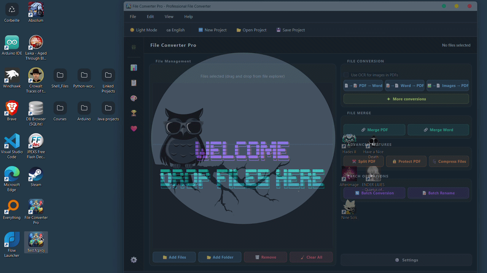
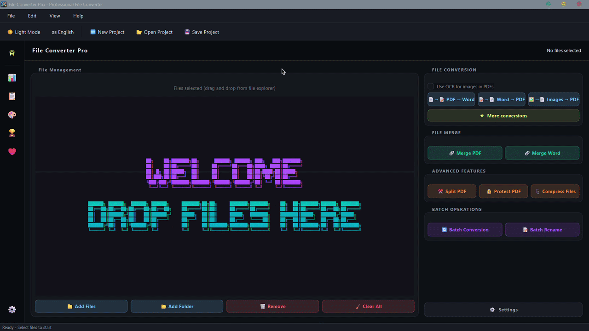
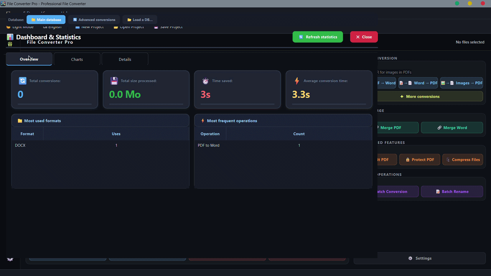
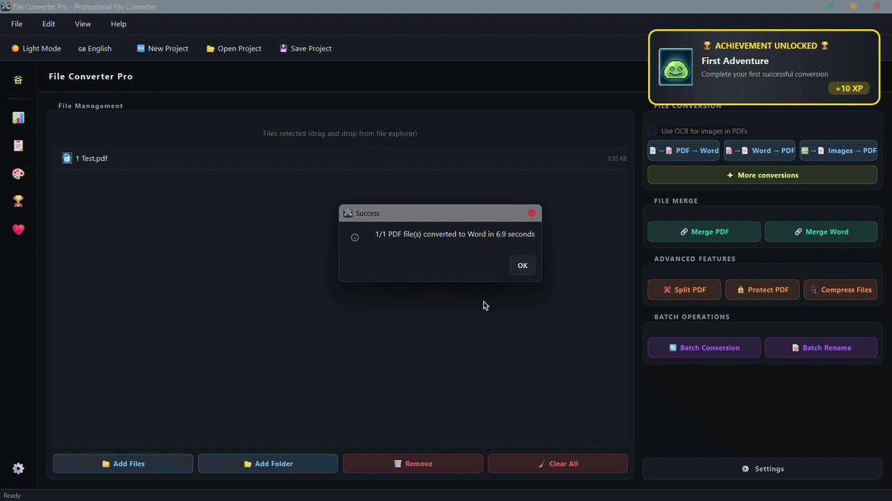
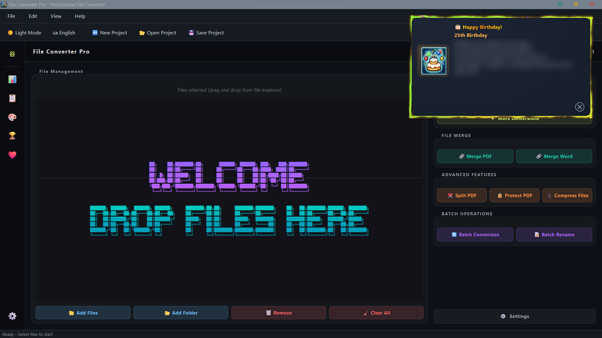
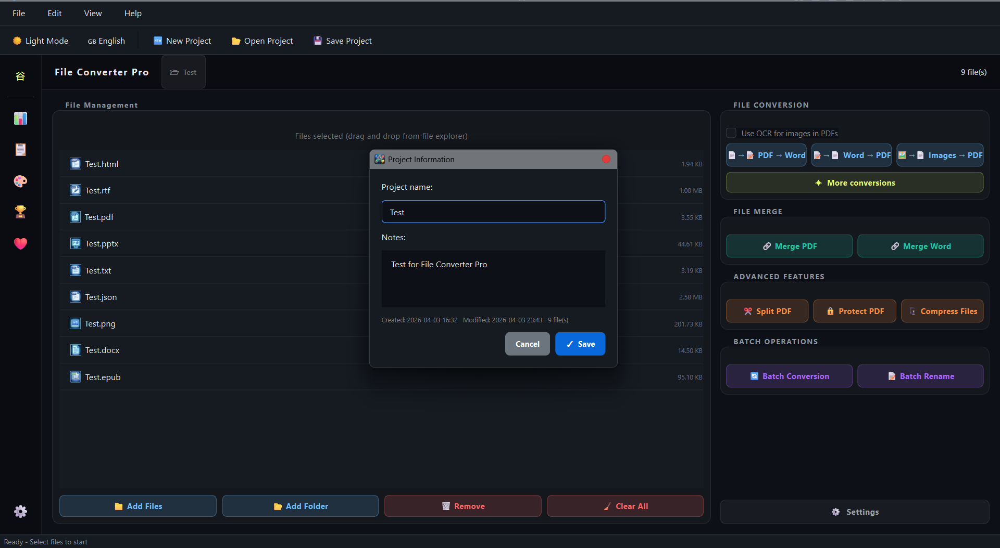
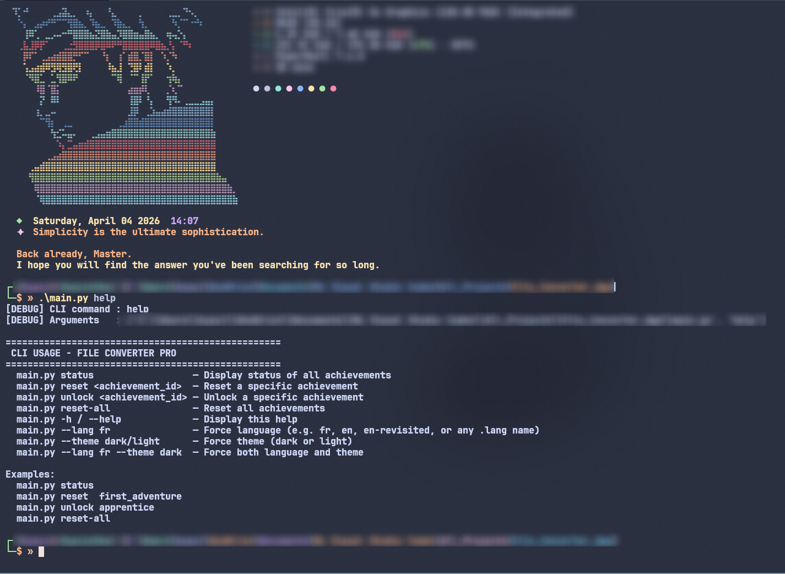
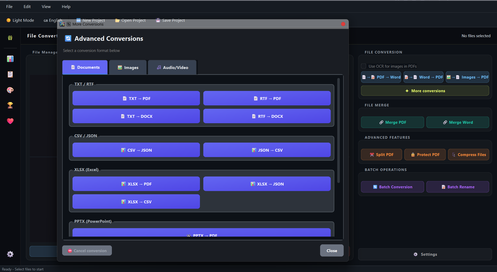
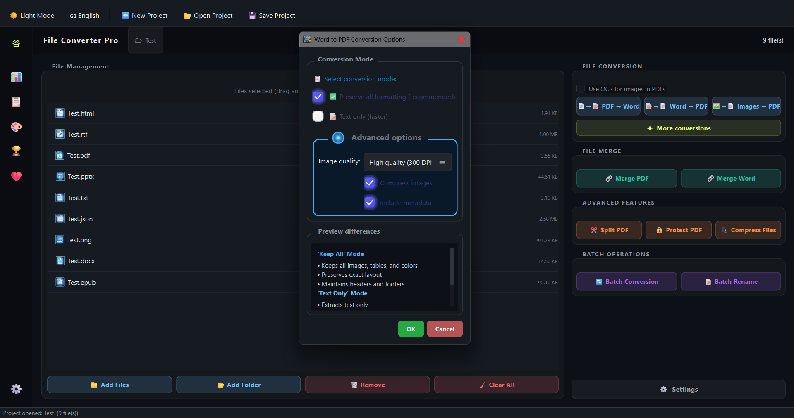

<div align="center">


<h1>File Converter Pro</h1>

<p><em>A free, offline, all-in-one file converter for Windows built to feel premium.</em></p>

[](#) [](#)
[](#) [](#license)
[](#) [](#)

<br/>

> 

<br/>

<details>
<summary><h2>📚 Table of Contents</h2></summary>

- [What is File Converter Pro?](#what-is-file-converter-pro)
- [✨ Features](#-features)
- [📂 Supported Formats](#-supported-formats)
- [🖥️ For End Users](#️-for-end-users)
  - [System Requirements](#system-requirements)
  - [Download & Install](#download--install)
  - [Optional Tools — Unlock Better Quality](#optional-tools--unlock-better-quality)
  - [🛡️ Windows Defender & Antivirus](#️-windows-defender--antivirus)
  - [⚡ Terminal Flash on Launch](#-terminal-flash-on-launch--its-safe)
- [👨‍💻 For Developers](#-for-developers)
  - [Prerequisites](#prerequisites)
  - [Clone & Install](#clone--install)
  - [Key Python Dependencies](#key-python-dependencies)
  - [Optional External Binaries](#optional-external-binaries)
  - [Running in Dev Mode](#running-in-dev-mode)
  - [Building the Exe](#building-the-exe)
  - [Project Structure](#project-structure)
- [🌐 Internationalization](#-internationalization)
- [⚠️ Known Limitations](#️-known-limitations)
- [🆚 How It Compares](#-how-it-compares)
- [🗺️ Roadmap](#️-roadmap)
- [💙 Support the Project](#-support-the-project)
- [🤝 Contributing](#-contributing)
- [🙏 Credits](#-credits)
- [🔧 Modifications & Contributions](#-modifications--contributions)
- [📋 Legal](#-legal)
- [📄 License](#-license)

</details>

</div>

---

## What is File Converter Pro?

File Converter Pro is a **free, fully offline Windows desktop application** that converts documents, images, audio, and video all from a single polished tool, without needing a browser or sending your files anywhere online.

It is built with Python and PySide6 and designed to feel like a real product: animated startup, system-aware dark/light theme, statistics dashboard, gamified achievements, multi-language support.

Most importantly, RAM consumption matters, especially as prices continue to rise. My app is lightweight, using around 250 MB in the executable version and around 125 MB when run from source.

Core philosophy: **ship nothing until it runs perfectly on a clean machine, with zero preinstalled dependencies.**

---

## ✨ Features

### 🔄 All-in-One Conversion
Documents, images, audio, and video, one tool instead of five browser tabs.
Batch conversions supported

### 🔒 100% Offline & Private
Your files never leave your machine. No telemetry, no uploads, no internet required for any conversion.

### Polished UI
- Automatic Dark / Light mode, read directly from the Windows registry
- Animated splash screen with a smooth crossfade into the main window
- Glassmorphism stat cards, hover effects, and fluid transitions throughout

<br/>

> 

<br/>

### 📊 Statistics Dashboard
A full Matplotlib-powered analytics panel showing your conversion history at a glance:
- Animated bar chart — conversions per day
- Animated filled line chart — processed data volume per day
- Animated donut chart — operation type breakdown
- Animated horizontal bar chart — format evolution over time
- Filterable history table with CSV/JSON/PDF export

<br/>

> 

<br/>


### Achievements & Rank Progression
A complete gamification system backed by SQLite:
- Achievements unlock based on conversion counts, format diversity, streaks, and special events
- Animated pop-ups appear in real time when an achievement is earned
- Rank-up celebration dialogs at milestone ranks
- Full achievements panel to browse locked and unlocked states

<br/>

> 

<br/>

### 🌐 Community i18n
Built-in **French** and **English**. Anyone can contribute a translation by dropping a `.lang` JSON file into the `languages/` folder — no source code changes needed. See [Internationalization](#-internationalization).

### Special Events
Date-aware special event overlays (birthdays, new year) with animated Perlin-noise liquid borders, particle confetti/sparkle systems, and per-event color theming. More events will be supported in future versions.

<br/>

> 

<br/>

### 📁 Project Files (`.fcproj`)
Save your conversion setups as project files. Double-clicking a `.fcproj` (with file association enabled) reopens the session instantly.
You can even add notes to the project so you know exactly what a project is about.

<br/>

> 

<br/>

### Drag & Drop onto the Exe
Drag one or more files directly onto `File Converter Pro.exe` — they'll be pre-loaded when the window opens.

### Single Instance
Launching a second instance focuses the already-running window instead of opening a duplicate.

### Encrypted Settings
User preferences are stored on disk using Fernet encryption (`cryptography` library) — no sensitive settings sit as plain text.

### Native Windows Notifications
Optional desktop notifications when a conversion finishes, using Windows' native notification system. 
NOTE: This is just for basic conversions, will support more conversions later.

### Quick Check Utility
A lightweight companion tool (`Quick Check.exe`) built with Tkinter — categorized scrollable tabs to verify that critical expected files are present in the installed build.

### 💻 CLI Mode *(development only)*

When running from source, `main.py` supports command-line arguments for managing achievements directly:
```
python main.py status              # List all achievement states
python main.py reset <id>          # Reset a specific achievement
python main.py unlock <id>         # Manually unlock an achievement
python main.py reset-all           # Wipe all achievement progress
python main.py --lang fr           # Force French on launch
python main.py --lang en           # Force English on launch
python main.py help                # Show CLI usage
```

> **Note:** These commands are intended for development use. The compiled `.exe` does not expose a console window, so CLI output would not be visible.

<br/>

> 

<br/>

---

## 📂 Supported Formats

<br/>

> 

<br/>

### 📄 Documents

| Input | Output | Engine chain |
|-------|--------|-------------|
| TXT | PDF | ReportLab → pypandoc (if Pandoc installed) |
| TXT | DOCX | Word COM → pypandoc → python-docx native |
| RTF | PDF | ReportLab native (full fidelity, no Office needed) |
| RTF | DOCX | Word COM → pypandoc → striprtf + python-docx |
| CSV | JSON | Native |
| JSON | CSV | Native |
| XLSX | PDF | Microsoft Excel COM → LibreOffice CLI → ReportLab (auto portrait/landscape, multi-sheet) |
| XLSX | JSON | openpyxl native |
| XLSX | CSV | openpyxl native |
| PPTX | PDF | Microsoft PowerPoint COM → LibreOffice CLI → python-pptx + ReportLab + Matplotlib |
| HTML | PDF | pdfkit (wkhtmltopdf) → WeasyPrint → ReportLab |
| PDF | HTML | PyMuPDF dict-mode (flow layout, base64-embedded images) |
| EPUB | PDF | pypandoc → spine-order native (images embedded) |

> **PDF → DOCX** has its own dedicated pipeline: `pdf2docx` (layout-preserving) → text-only fallback → image+text hybrid. Quality depends on the source PDF — scanned PDFs without embedded text are only partially recoverable.

> **`.ppt` (legacy binary format)**: requires Microsoft Office or LibreOffice to be installed. python-pptx cannot open old `.ppt` files natively.

### 🖼️ Images

| Input | Output | Notes |
|-------|--------|-------|
| JPEG / JPG | PNG | EXIF preserved |
| PNG | JPG | Max quality, EXIF preserved |
| WebP | PNG | |
| BMP | PNG | |
| TIFF | PNG | |
| HEIC | PNG | via `pillow-heif` |
| GIF | PNG | |
| Any image | ICO | Multi-resolution icon generation |

All image conversions use Pillow at maximum quality with EXIF metadata preserved.

### 🔊 Audio

| Input | Output |
|-------|--------|
| WAV | MP3 |
| MP3 | WAV |
| AAC | MP3 |
| MP3 | AAC |
| FLAC | MP3 |
| OGG | MP3 |
| MP4 | MP3 |
| AVI | MP3 |
| WebM | MP3 |
| MKV | MP3 |

### 🎬 Video

| Input | Output |
|-------|--------|
| AVI | MP4 |
| WebM | MP4 |
| MKV | MP4 |
| MOV | MP4 |

All audio and video conversions are powered by a bundled `ffmpeg` binary located automatically at runtime, with quality presets per format. (you have to install it yourself)

---

## 🖥️ For End Users

This section is for anyone who just wants to **download and use** the app. No Python, no terminal, no setup beyond running an installer or downloading the portable version.

**NOTE:** **FFMPEG** is absolutely required for Audio/Video conversions, if you try an audio/video conversion without it, you'll get a command to download it.

<br/>

> 

<br/>

---

### System Requirements

| Component | Requirement |
|-----------|------------|
| **OS** | Windows 10 or Windows 11 (64-bit) |
| **RAM** | 4 GB minimum — 8 GB recommended |
| **Disk** | ~500 MB free (~435 MB compiled, inherent to the Python / PySide6 / Matplotlib ecosystem) |
| **Display** | 1280 × 720 or higher |
| **Dependencies** | None — fully self-contained |

---

### Download & Install

#### Option A — Installer *(recommended)*

Download the latest **`FileConverterPro_Setup_v1.0.1.exe`** from the [Releases](../../releases) page and run it.

The installer:
- Supports both **English** and **French** during setup
- Runs **without administrator rights**
- Targets **64-bit Windows only** (Windows 10 / 11)
- Optionally creates a **Desktop shortcut**
- Optionally associates **`.fcproj`** project files with the app
- Offers to add a **Windows Defender exclusion** for the install folder (recommended — see [below](#️-windows-defender--antivirus))

Once installed, launch **File Converter Pro** from the Start Menu or Desktop shortcut. That's it.

#### Option B — Portable *(no install)*

If you'd rather not run an installer, download the portable `.zip` from the [Releases](../../releases) page, extract it anywhere, and run `File Converter Pro.exe` directly.

All settings, history, and achievements are stored in the same folder as the executable — move the folder, everything moves with it.

> ⚠️ The portable version does not create automatic file associations for `.fcproj` files. You can still open project files via **File → Open Project** inside the app or **open with → Select the File Converter Pro exe**

---

### Optional Tools — Unlock Better Quality

File Converter Pro works **out of the box with zero dependencies**. Every conversion has a built-in fallback engine that runs on a clean machine. However, if you install any of the tools below, the app will detect them automatically and use them to produce higher-quality output. No configuration needed.

| Tool | What it unlocks | Where to get it |
|------|----------------|-----------------|
| **Microsoft Office** (Word, Excel, PowerPoint) | Pixel-perfect DOCX/XLSX/PPTX → PDF via COM automation. Also required for legacy `.ppt` files. | Microsoft 365 or standalone Office |
| **LibreOffice** | High-quality PPTX → PDF and XLSX → PDF when Office is not installed. | [libreoffice.org](https://www.libreoffice.org/download/download/) |
| **Pandoc** | Better TXT / RTF / EPUB → PDF quality; RTF → DOCX with proper formatting. | [pandoc.org](https://pandoc.org/installing.html) |
| **MiKTeX** *(or any TeX distribution)* | Enables Pandoc's LaTeX PDF pipeline for best typographic output on TXT → PDF. Install alongside Pandoc. | [miktex.org](https://miktex.org/download) |
| **wkhtmltopdf** | Best HTML → PDF rendering — full CSS, fonts, local images. Used as the first-choice engine for HTML conversions. | [wkhtmltopdf.org](https://wkhtmltopdf.org/downloads.html) |

**Conversion quality tiers at a glance:**

```
PPTX → PDF:   PowerPoint COM  ›  LibreOffice CLI  ›  python-pptx + ReportLab
XLSX → PDF:   Excel COM       ›  LibreOffice CLI  ›  ReportLab native
TXT  → PDF:   ReportLab       ›  pypandoc  (needs Pandoc + MiKTeX for LaTeX output)
HTML → PDF:   wkhtmltopdf     ›  WeasyPrint        ›  ReportLab
RTF  → DOCX:  Word COM        ›  pypandoc          ›  striprtf + python-docx
```

---

### 🛡️ Windows Defender & Antivirus

It is **strongly recommended** to add the File Converter Pro installation folder to your Windows Defender exclusion list. The installer will offer to do this automatically during setup.

**Why?** The app bundles:
- A `ffmpeg` binary (commonly flagged by heuristic scanners)
- A PyInstaller-compiled Python executable (another common false-positive trigger)

The application makes **no outbound network calls** during conversions and contains no malicious code. If your antivirus flags it, it is a false positive.

If you have installed the portable version and you want to add the folder as an exclusion, run this PowerShell command:

```powershell
Add-MpPreference -ExclusionPath "C:\Your\Folder\File Converter Pro"
```
Or add it manually in Windows Defender.

---

### ⚡ Terminal Flash on Launch — It's Safe

When you first launch `File Converter Pro.exe`, a **black terminal window may flash briefly** before disappearing.

**This is completely normal and harmless.** It is due to ffmpeg setting up, if you do not have ffmpeg you won't notice a flash. It is not a virus, it does not run any hidden script, and it does not connect to the internet.

You can safely ignore it. The GUI will appear immediately after. Or if you still doubt, you can check the code source or built it yourself to have the proves

---

## 👨‍💻 For Developers

This section is for contributors, translators, and anyone who wants to **run or build the project from source**.

---

### Prerequisites

Make sure the following are installed on your machine before cloning:

| Tool | Version | Purpose |
|------|---------|---------|
| **Python** | 3.11 or 3.13 recommended | Runtime |
| **pip** | Latest | Package manager |
| **Git** | Any recent | Cloning the repo |
| **PyInstaller** | 6.x | Building the `.exe` |

> Python 3.13 is what the project is currently compiled against. Other versions may work but are untested. As advice, do not use too recent Python versions because they may not support all libraries yet.

---

### Clone & Install

```bash
git clone https://github.com/Hyacinthe-primus/file-converter-pro.git
cd file-converter-pro
pip install -r requirements.txt
```

Then launch the app directly:

```bash
python main.py
```

---

### Key Python Dependencies

These are installed automatically via `requirements.txt`:

| Package | Role |
|---------|------|
| `PySide6` | UI framework (Qt6 bindings) |
| `pdf2docx` | PDF → DOCX layout-preserving pipeline |
| `pymupdf` (`fitz`) | PDF rendering and HTML export |
| `reportlab` | Native PDF generation fallback |
| `pypandoc` | Pandoc bridge (TXT/RTF/EPUB → PDF/DOCX) |
| `python-docx` | DOCX creation and editing |
| `python-pptx` | PPTX reading and rendering |
| `openpyxl` | XLSX reading and conversion |
| `Pillow` | Image conversion engine |
| `pillow-heif` | HEIC format support |
| `striprtf` | RTF text extraction fallback |
| `matplotlib` | Statistics dashboard charts |
| `cryptography` | Fernet-encrypted config storage |
| `comtypes` | Windows COM automation (Office/PowerPoint/Excel) |

> `comtypes` is Windows-only. It is used to call Microsoft Office via COM for pixel-perfect document-to-PDF conversion. It gracefully no-ops on machines without Office installed.

---

### Optional External Binaries

Some conversion pipelines rely on external binaries that must be installed separately. Currently, the only truly required one is FFmpeg, the others are optional. The app auto-detects them at runtime. No path configuration needed.

| Binary | Used for | Install |
|--------|---------|---------|
| `ffmpeg` | All audio and video conversions | Bundled in the compiled exe — for dev, install via [ffmpeg.org](https://ffmpeg.org/download.html) or `winget install ffmpeg` |
| `pandoc` | High-quality TXT/RTF/EPUB → PDF/DOCX | [pandoc.org](https://pandoc.org/installing.html) |
| `MiKTeX` / `pdflatex` | LaTeX-based PDF rendering via Pandoc | [miktex.org](https://miktex.org/download) |
| `wkhtmltopdf` | HTML → PDF (pdfkit Strategy 1) | [wkhtmltopdf.org](https://wkhtmltopdf.org/downloads.html) |
| `soffice` (LibreOffice) | PPTX/XLSX → PDF fallback | [libreoffice.org](https://www.libreoffice.org/download/download/) |

---

### Running in Dev Mode

Force a specific language on launch:

```bash
python main.py --fr
python main.py --lang en
python main.py --lang "Custom English"         # any .lang file in languages/
```

Force a specific theme:

```bash
python main.py --theme dark
python main.py --theme light
```

Both at the same time:

```bash
python main.py --en --theme light
python main.py --lang "Custom English" --theme dark
```

#### Achievement CLI commands

Useful during development to inspect or reset the achievement database without launching the full GUI:

```bash
python main.py status                    # Print all achievement states
python main.py reset <achievement_id>    # Reset a specific achievement
python main.py unlock <achievement_id>   # Manually unlock an achievement
python main.py reset-all                 # Wipe all progress (prompts confirmation)
python main.py help                      # Show CLI usage
```

> These commands print to stdout and are only usable when running from source (`python main.py`). The compiled `.exe` does not expose a console window, so this output would not be visible.

---

### Building the Exe

The project uses **PyInstaller** + **UPX** for compression. Build scripts are PowerShell-based.

#### 1. Install build tools

```powershell
pip install pyinstaller
winget install UPX.UPX   # or download manually from upx.github.io
```

#### 2. Build the main application

```powershell
.\build.ps1
```

This runs PyInstaller with `build.spec` and produces a `dist/File Converter Pro/` onedir output.

#### 3. Build the Quick Check utility

```powershell
.\build_quick_check.ps1
```

#### 4. Package everything into an installer

```powershell
.\build_installer.ps1
```

This calls **Inno Setup** with `setup.iss` and produces `Output/FileConverterPro_Setup_v1.0.1.exe`.

> Make sure **Inno Setup** is installed and on your PATH before running step 4. Download it at [jrsoftware.org/isinfo.php](https://jrsoftware.org/isinfo.php).

#### Full pipeline at once

```powershell
.\build_all.ps1
```

---

### Project Structure

```
File Converter Pro/
│
├── main.py                       # Entry point — splash, single instance, CLI, drag & drop
├── config.py                     # Encrypted config manager, Windows dark mode detection
├── translations.py               # i18n engine (FR/EN built-in + .lang file support)
├── conversion_worker.py          # Background QThread conversion worker
├── advanced_conversions.py       # Extra conversion routines
├── dashboard.py                  # Statistics dashboard (Matplotlib animated charts)
├── database.py                   # SQLite abstraction layer
├── donate.py                     # Donation dialog — PayPal, animated UI, donor flag
├── history.py                    # Conversion history panel
├── widgets.py                    # Shared custom Qt widgets (AnimatedCheckBox, etc.)
├── special_events_manager.py     # Date-aware special events (birthday, new year…)
├── system_notifier.py            # Native Windows desktop notifications
├── quick_check.py                # Companion build-verification tool (Tkinter)
│
├── app/
│   ├── __init__.py               # FadingMainWindow, FileConverterApp
│   ├── ui.py                     # AppUIMixin — all UI construction
│   └── logic.py                  # AppLogicMixin — all business logic
│
├── converter/
│   ├── converters.py             # AdvancedConverterEngine — all format pipelines
│   └── advanced_db.py            # SQLite DB for conversion stats
│
├── achievements/
│   ├── achievements_system.py    # Achievement definitions and unlock logic
│   ├── achievements_manager.py   # Persistence and state management
│   ├── achievements_ui.py        # Full achievements panel UI
│   ├── achievements_popup.py     # Animated real-time unlock pop-up
│   └── rank_popup.py             # Rank-up celebration dialog
│
├── dialogs/
│   ├── dialogs.py                # General-purpose dialogs
│   ├── terms_dialog.py           # Terms & Privacy acceptance dialog
│   └── word_to_pdf_dialog.py     # Word → PDF options dialog (mode, quality, metadata)
│
└── templates/
    ├── templates.py              # Conversion template definitions
    └── template_manager.py       # Save / load / apply templates
```

**Main window inheritance chain:**

```
QMainWindow
  └── AppLogicMixin        (app/logic.py)
        └── AppUIMixin           (app/ui.py)
              └── FileConverterApp
                    └── FadingMainWindow    ← what gets instantiated at runtime
```

---

## 🌐 Internationalization

File Converter Pro ships with built-in **French** and **English**.

Anyone can add a new language without touching the source code. Create a `.lang` file (UTF-8 JSON) and place it in the `languages/` folder next to the executable — it will be detected and listed in Settings automatically on next launch.

**`.lang` file format:**

```json
{
  "meta": {
    "code":        "EN",
    "name":        "English",
    "author":      "Your Name",
    "version":     "1.0",
    "created":     "2026-02-06",
    "description": "English translation"
  },
  "strings": {
    "Paramètres":  "Settings",
    "Fermer":     "Close",
    "Gestion des Fichiers": "File Management",
  }
}
```

You can also force a language from the command line *(development only)* :

```
main.py --lang de
main.py --lang en-revisited
main.py --lang "my custom language"
```

---

## ⚠️ Known Limitations

| Area | Details |
|------|---------|
| **Windows only** | Word/Excel/PowerPoint COM automation, registry-based dark mode detection, and PyInstaller packaging are all Windows-first. macOS / Linux are not currently supported. (will come later) |
| **Build size** | ~435 MB compiled — inherent to Python + PySide6 + Matplotlib + pdf2docx and other libraries |
| **PDF → DOCX quality** | Depends on the source PDF. Scanned PDFs with no embedded text layer are only partially recoverable without an OCR tool. |
| **`.ppt` legacy format** | Requires Microsoft Office or LibreOffice. python-pptx cannot open old binary `.ppt` files natively. |
| **Donation Thank-You** | The thank-you dialog requires a relaunch after donating. If the app is never relaunched, the flag remains pending. |
| **No cloud / sync** | History, settings, and achievements are stored locally only — no backup, no multi-device profiles. |
| **Manual distribution** | Not on the Microsoft Store. Distributed via GitHub or Itch.io. |
| **Solo development** | Progression on the application depends on availability outside of studies. |

---

## 🆚 How It Compares

There are plenty of ways to convert files. Here's where File Converter Pro fits in:

| | File Converter Pro | CloudConvert / Zamzar | HandBrake | Format Factory | PDF24 | XnConvert |
|---|---|---|---|---|---|---|
| **Offline / no upload** | ✅ | ❌ Files uploaded | ✅ | ✅ | ✅ | ✅ |
| **Documents** | ✅ | ✅ | ❌ | ❌ | ⚠️ PDF only | ❌ |
| **Images** | ✅ | ✅ | ❌ | ✅ | ❌ | ✅ |
| **Audio** | ✅ | ✅ | ❌ | ✅ | ❌ | ❌ |
| **Video** | ✅ | ✅ | ✅ | ✅ | ❌ | ❌ |
| **Free, no limits** | ✅ | ⚠️ 25/day free tier | ✅ | ✅ | ✅ | ✅ |
| **Themed UI (dark/light)** | ✅ | N/A | ❌ | ❌ | ❌ | ❌ |
| **Conversion history & stats** | ✅ | ❌ | ❌ | ❌ | ❌ | ❌ |
| **Multi-engine fallback** | ✅ | N/A | N/A | N/A | N/A | N/A |

> Online tools like CloudConvert and Zamzar are excellent for occasional use, but they require uploading files to external servers and often impose daily limits on free plans. File Converter Pro is designed for users who convert files frequently and prioritize speed, privacy, and local processing.

**NOTE:** These comparisons are intended to highlight different use cases rather than criticize other tools; the best choice simply depends on your specific needs.

---

## 🗺️ Roadmap

See [ROADMAP.md](ROADMAP.md) for the full list of planned features and future directions.

**Highlights:**
- 👥 User profiles — multiple independent profiles on the same machine
- 🔔 Extended system notifications — covering long-running batch conversions
- 📂 Watch folder — auto-convert anything dropped into a monitored folder
- ⏱️ Batch scheduling — run conversions at a set time or on a recurring schedule
- 📊 Dashboard upgrades — period comparison, achievement timeline, PDF export
- 🧩 Plugin system — add custom converters via external Python scripts
- 🌐 Local REST API — integrate conversions into scripts and automation workflows
- ✅ Automated test suite — regression coverage for all conversion engines

---

## 💙 Support the Project

File Converter Pro is and will remain **completely free**. If it saves you time, a voluntary donation is always appreciated and helps fund continued development.

<div align="center">

[](https://www.paypal.com/donate/?hosted_button_id=GLKSMC6SYBFHG)


</div>

The donation dialog is also accessible anytime from **Left Tab → Support the project** inside the app itself.

---

## 🤝 Contributing

The project is being prepared for open-sourcing. All source comments and docstrings have been translated from French to English for this purpose.

**Translations** are the easiest way to contribute right now — follow the `.lang` format above, open an issue, and attach your file or submit a pull request.

For **bug reports**, please include:
- Your Windows version
- The input and output format you were trying to convert
- Any error message or unexpected behavior
- Whether Microsoft Office, LibreOffice, Pandoc, or MiKTeX are installed on your machine

***Report here:*** [Signal a Bug or Malfunction](mailto:hyacintheatho91@gmail.com)

---

## 🙏 Credits

File Converter Pro was designed, built, and maintained by **Hyacinthe** (Prime Enterprises).

### Open-Source Libraries

This project is made possible by the following open-source projects:

| Library | Use |
|---------|-----|
| [PySide6 / Qt](https://www.qt.io/) | UI framework |
| [FFmpeg](https://ffmpeg.org/) | Audio & video conversion |
| [pdf2docx](https://github.com/ArtifexSoftware/pdf2docx) | PDF → DOCX conversion |
| [PyMuPDF](https://github.com/pymupdf/PyMuPDF) | PDF rendering & HTML export |
| [ReportLab](https://www.reportlab.com/) | Native PDF generation |
| [pypandoc](https://github.com/JessicaTegner/pypandoc) | Pandoc bridge |
| [MiKTeX](https://miktex.org/) | LaTeX PDF rendering via Pandoc |
| [python-docx](https://github.com/python-openxml/python-docx) | DOCX generation |
| [python-pptx](https://github.com/scanny/python-pptx) | PPTX rendering |
| [openpyxl](https://openpyxl.readthedocs.io/) | XLSX reading |
| [Pillow](https://python-pillow.org/) | Image processing |
| [Matplotlib](https://matplotlib.org/) | Statistics charts |
| [cryptography](https://cryptography.io/) | Encrypted settings |
| [PyInstaller](https://pyinstaller.org/) | Windows executable packaging |
| [Inno Setup](https://jrsoftware.org/isinfo.php) | Installer creation |
| [UPX](https://upx.github.io/) | Executable compression |

### Special Thanks

A huge thanks to everyone who has supported the project whether by testing the app, reporting bugs, contributing translations, sharing the link, or **starring this repository**. Your support makes a real difference!

---

## 🔧 Modifications & Contributions

This project is **Open Source**. You are free to **fork, modify, and adapt** the code for your own projects, provided that you comply with the terms of the GPLv3 License.

If you use or adapt this project, please include:
- A link to the original repository: [github.com/Hyacinthe-primus/File_Converter_Pro](https://github.com/Hyacinthe-primus/File_Converter_Pro)

> [!TIP]
> While the GPLv3 allows for many uses, keeping your modifications open-source is a requirement. For any inquiries regarding use cases not covered by this license, feel free to reach out.

> [!IMPORTANT]
> **Dual Licensing:** This project is available under the GPLv3 for open-source use.
> For integration into proprietary or commercial products without sharing your code, a separate commercial license
> is available. Read it down in LICENSE section.

---

## 📋 Legal

To ensure transparency and privacy, please review our legal documents:

* [Privacy Policy](legal/privacy_policy_en.html)
* [Terms of Use](legal/terms_conditions_en.html)

---

## 📄 License

This project uses a **dual licensing model**:

- **Open-Source (GPLv3):** Free to use, modify, and distribute under the terms of the GNU General Public License v3. Full license terms is also available here:

  * [`LICENSE.txt`](LICENSE/LICENSE.txt)

- **Commercial License:** For integration into proprietary or closed-source products, a separate commercial license is required. Please contact the author for explicit permission: read more here: [Commercial license](COMMERCIAL_LICENSE.md)

© 2026 Prime Enterprises (Hyacinthe). All rights reserved.

---

<div align="center">
<sub>Built by Hyacinthe <em>because file conversion should actually feel good.</em></sub>
</div>
